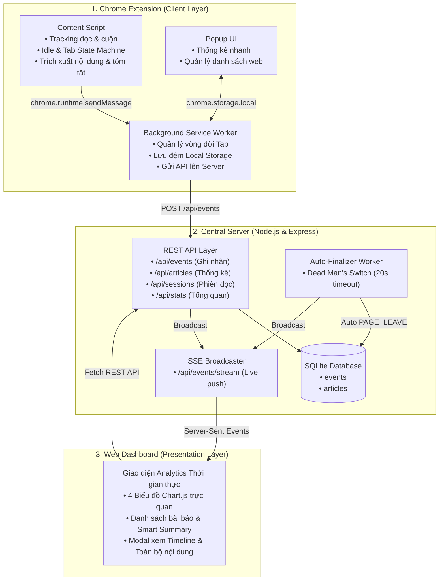

# Article Tracker

A Chrome extension and Central Server that tracks article reading sessions — including active reading time, scroll depth, and article content — across configurable news websites.

---

## Folder Structure

```text
article-tracker/
├── extension/             # Chrome Extension (Manifest V3)
│   ├── manifest.json
│   ├── background/background.js
│   ├── content/content.js
│   ├── popup/
│   └── options/
└── server/                # Central Server (Node.js/Express + SQLite)
    ├── package.json
    ├── server.js          # Express app (:3000)
    ├── db.js              # SQLite database manager
    ├── middleware/
    │   └── validator.js   # Event schema validation
    ├── routes/
    │   ├── events.js      # POST/GET /api/events
    │   ├── sessions.js    # GET /api/sessions, GET /api/sessions/:id
    │   └── articles.js    # GET /api/articles
    └── data/
        └── tracker.db     # SQLite database file
```

---

## Installation & Running

### 1. Run Central Server

```bash
cd server
npm install
npm start
```
Server runs at `http://localhost:3000`.

### 2. Install Chrome Extension

1. Open Chrome and navigate to `chrome://extensions/`.
2. Enable **Developer mode** (top right).
3. Click **Load unpacked** and select the `extension/` folder.
4. The extension will automatically track articles and sync events to the Central Server.

---

## Describe solutions to the questions

### Question 1: "Hãy trình bày cách xác định thời gian người dùng thực sự đọc bài báo, thay vì chỉ tính thời gian tab được mở"

Người dùng thực sự đọc bài báo khi:
- Tab được mở
- Tab được chọn
- Cửa sổ Chrome đang được focus
- Người dùng có tương tác như di chuyển chuột, cuộn trang, click vào các phần tử trong bài báo

---

### Question 2: "Đề xuất cấu trúc dữ liệu event"

```json
{
  "event_id": "c4b3a120-7f28-4e12-89a1-5d9c73b06ef1",
  "event_type": "PAGE_ACTIVE",
  "session_id": "sess-92a01f44-9382-4112-a16f-1290bb34e101",
  "url": "https://vnexpress.net/khoa-hoc/tri-tue-nhan-tao-y-te-2026.html",
  "domain": "vnexpress.net",
  "title": "Trí tuệ nhân tạo tạo bước đột phá trong y tế",
  "timestamp": "2026-08-30T00:15:30.125Z",
  "payload": {
    "reason": "user_resume",
    "active_reading_time_sec": 45,
    "scroll_percent": 68
  }
}
```

---

### Question 3: "Xác định cách tạo và quản lý session_id"

#### 1. Cách tạo session_id
- **Nơi khởi tạo:** Phía Client (Content Script) ngay khi trang bài báo được tải xong.
- **Phương pháp tạo:** Sử dụng hàm chuẩn crypto.randomUUID() (UUID v4) của trình duyệt để đảm bảo tính duy nhất tuyệt đối trên toàn cầu mà không sợ bị trùng lặp.
- **Vòng đời:** Mỗi lần người dùng mở một bài báo mới (hoặc bấm F5 tải lại trang), một session_id độc lập sẽ được sinh ra để đại diện cho đúng phiên đọc đó.

#### 2. Cách quản lý session_id
- **Gắn kèm vào mọi sự kiện:** `Content Script` đính kèm `session_id` vào tất cả các sự kiện (`PAGE_ENTER`, `PAGE_ACTIVE`, `PAGE_INACTIVE`, `PAGE_LEAVE`) khi gửi về `Background Script`.
- **Lưu trữ cục bộ:** `Background Script` lưu toàn bộ chuỗi sự kiện theo `session_id` vào `chrome.storage.local`.
- **Gom nhóm và hiển thị:** `Popup` truy vấn dữ liệu từ Storage, gom nhóm các sự kiện theo `session_id` để tính tổng thời gian đọc, độ cuộn trang và vẽ Timeline chi tiết cho từng phiên.
- **Theo dõi khi đóng Tab:** `Background Script` duy trì ánh xạ `tabId -> session_id`. Khi người dùng tắt tab (`chrome.tabs.onRemoved`), Background sẽ tự động phát sự kiện `PAGE_LEAVE` để chốt phiên cho đúng `session_id` đó.

---

### Question 4: "Giải thích tại sao nên lưu dữ liệu dạng event thay vì chỉ lưu một bản ghi tổng hợp sau khi người dùng kết thúc đọc bài báo"

- **Theo dõi chính xác hành vi:** vào trang, đọc, rời đi, quay lại
- **Bị thoát đột ngột thì chỉ mất EVENT cuối cùng**
- **Tính lại thời gian đọc thực tế nếu cần**
- **Dễ kiểm tra, phát hiện lỗi và mở rộng thêm các loại hành vi sau này**

---

### Question 5: "Xử lý các tình huống thực tế"

#### 1. Người dùng mở đồng thời nhiều tab
- **Cơ chế:** Khi bài báo được mở ở tab nền (`document.visibilityState === "hidden"` hoặc chưa focus), Content Script chỉ ghi nhận `PAGE_ENTER` ở trạng thái `inactive` mà **không** phát `PAGE_ACTIVE`.
- **Xử lý:** Timer đọc thời gian thực không đếm thời gian ảo và không gửi heartbeat. Chỉ khi người dùng thực sự chọn tab đó, hệ thống mới phát `PAGE_ACTIVE` và bắt đầu tính giờ đọc.

#### 2. Người dùng chuyển liên tục giữa các tab
- **Cơ chế:** Lắng nghe kết hợp các sự kiện `visibilitychange`, `window.focus`, `window.blur` và `chrome.tabs.onActivated` từ Background Script.
- **Xử lý:** Ngay khi người dùng rời tab, hệ thống ép tính toán thời gian đọc đến đúng mili-giây đó (`calculateReadingTime(true)`), phát `PAGE_INACTIVE` và tạm dừng timer. Khi quay lại, hệ thống phát `PAGE_ACTIVE` và tiếp tục tích lũy thời gian chính xác, không bị tính chồng chéo giữa các tab.

#### 3. Người dùng mở tab nhưng không thao tác trong thời gian dài (Idle)
- **Cơ chế:** Thiết lập ngưỡng `IDLE_THRESHOLD = 30s` và theo dõi tương tác người dùng (`scroll`, `mousemove`, `mousedown`, `keydown`, `touchstart`).
- **Xử lý:** Nếu sau 30 giây không có thao tác, hệ thống tự động phát sự kiện `PAGE_INACTIVE (reason: "user_idle")`, dừng tính thời gian đọc và ngừng gửi heartbeat. Ngay khi có tương tác trở lại, hệ thống phát `PAGE_ACTIVE (reason: "user_resume")` để tiếp tục tính thời gian.

#### 4. Người dùng đóng Chrome đột ngột nên không phát sinh PAGE_LEAVE
- **Đồng bộ lũy tiến (Client):** Extension gửi kèm thời lượng đọc tích lũy `active_reading_time_sec` trong mỗi Heartbeat 5s (sai số mất mát dữ liệu tối đa $\le 5s$).
- **Dead Man's Switch (Server Auto-Finalizer):** Server chạy worker ngầm định kỳ quét các phiên đọc. Nếu một session quá **20 giây** không nhận được heartbeat mới, Server sẽ **tự động sinh một sự kiện `PAGE_LEAVE` ảo** (`exit_type: "timeout_abrupt_exit"`) vào database và chốt trạng thái `COMPLETED`.

#### 5. Extension gửi cùng một event nhiều lần
- **Máy trạng thái (Client State-Machine):** Content Script duy trì biến `currentTrackingStatus`. Các hàm `transitionToActive` và `transitionToInactive` sẽ kiểm tra và chặn ngay lập tức nếu trạng thái hiện tại đã trùng, loại bỏ hoàn toàn hiện tượng gửi trùng từ `blur`, `hidden` hay `tab_inactive` diễn ra cùng lúc.
- **Khử trùng lặp (Server Deduplication):** Server kiểm tra nếu nhận 2 event cùng `session_id`, cùng `event_type` trong vòng $< 1000\text{ms}$ thì chỉ cập nhật đè bản ghi cũ thay vì tạo thêm dòng mới trong database.

#### 6. Mất kết nối Internet trong thời gian Extension đang hoạt động
- **Bộ nhớ đệm cục bộ (Local Queue Buffer):** Extension luôn lưu trữ chuỗi sự kiện vào `chrome.storage.local` trước khi gửi lên Server.
- **Cơ chế Retry (Tự đồng bộ lại):** Nếu gửi API thất bại do mất mạng, dữ liệu vẫn an toàn trong Storage. Extension lắng nghe sự kiện `window.addEventListener('online')` hoặc thực hiện retry định kỳ để đồng bộ toàn bộ hàng đợi sự kiện lên Server ngay khi có kết nối trở lại.

#### 7. Website thay đổi cấu trúc HTML làm chức năng lấy nội dung bài báo không chính xác
- **Cấu hình động (Dynamic Website Config):** Danh sách domain và bộ chọn `articleSelector` được quản lý dạng JSON trong `chrome.storage.local` và có thể cập nhật từ xa qua API `GET /api/websites/config` mà không cần cài đặt lại Extension.
- **Fallback Multi-Selectors & Meta tags:** Content Script hỗ trợ danh sách bộ chọn dự phòng (`article`, `.main-content`, `.detail-content`, `.sapo`, `meta[name='description']`, `meta[property='og:description']`).
- **Thuật toán tóm tắt thông minh (Smart Extractive Summary):** Nếu không tìm thấy tóm tắt có sẵn trên website, hệ thống sẽ tự động phân tích và trích xuất các câu mở đầu mang nội dung chính của bài báo.

---

## System Architecture



## Completed Features

### Chrome Extension (Manifest V3)

* **Active Reading Time:** Tính thời gian đọc thực tế dựa trên trạng thái tab, window focus và user interaction.
* **Idle Detection:** Tự động chuyển `PAGE_INACTIVE` sau 30s không tương tác và resume khi người dùng tiếp tục đọc.
* **Scroll Depth Tracking:** Theo dõi `max_scroll_percent` từ 0–100%.
* **Article Extraction & Summary:** Trích xuất toàn văn và Sapo từ selector, Meta tags hoặc câu mở đầu.
* **Finite State Machine:** Ngăn chặn duplicate events khi chuyển tab/window.
* **Multi-tab Tracking:** Tính chính xác thời gian đọc khi chuyển đổi giữa nhiều tab.
* **Session Finalization:** Phát `PAGE_LEAVE` khi đóng trang/tab.
* **Heartbeat:** Gửi dữ liệu tích lũy mỗi 5s, giảm mất dữ liệu khi trình duyệt bị tắt đột ngột.
* **Popup & Options:** Xem lịch sử đọc, thống kê và cấu hình website/selectors.

### Central Server

* **RESTful API:** Events, Articles, Sessions, Statistics và Database Reset.
* **SQLite Database:** Lưu `events` và `articles` với các index cần thiết.
* **Dead Man's Switch:** Tự động finalize session sau 20s mất tín hiệu.
* **Server-Sent Events (SSE):** Cập nhật dữ liệu Dashboard theo thời gian thực.

### Web Analytics Dashboard

* **Light Mode UI:** Giao diện hiện đại, tối ưu cho việc theo dõi số liệu.
* **4 Real-time Charts:** Reading Time, Website Distribution, Scroll Depth và Reading Hours.
* **Article Management:** Tìm kiếm, lọc và sắp xếp bài báo.
* **Article Detail Modal:**

  * Smart Summary
  * Full Article Content
  * Event Timeline

## Current Limitations

* **Offline Retry Queue:** Chưa có hàng đợi tự động retry/batch sync khi mất mạng.
* **Remote Config Sync:** Website selectors hiện chỉ được cấu hình local, chưa đồng bộ từ Server.
* **Delayed SPA Content:** Chưa hỗ trợ tối ưu các website SPA tải nội dung động.
